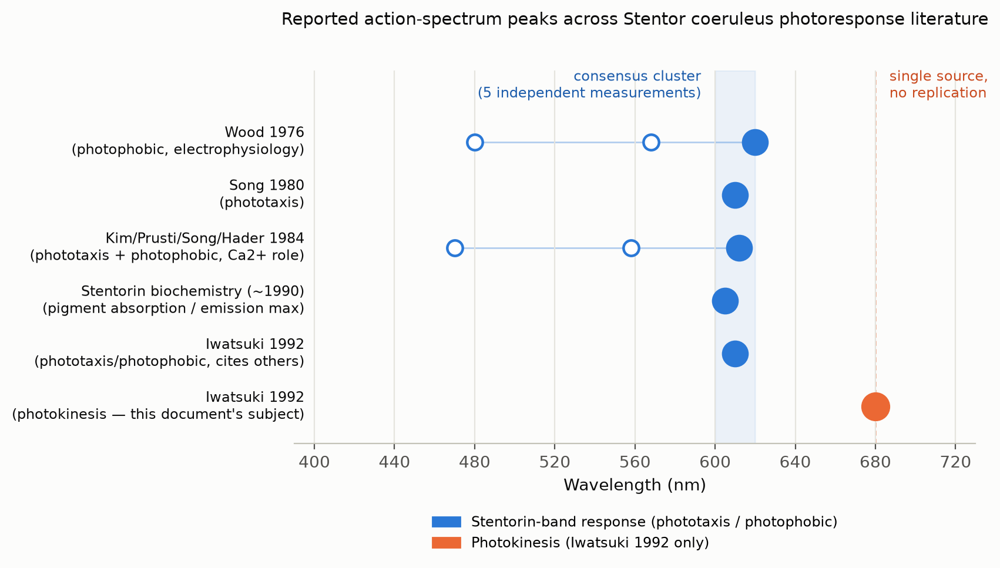
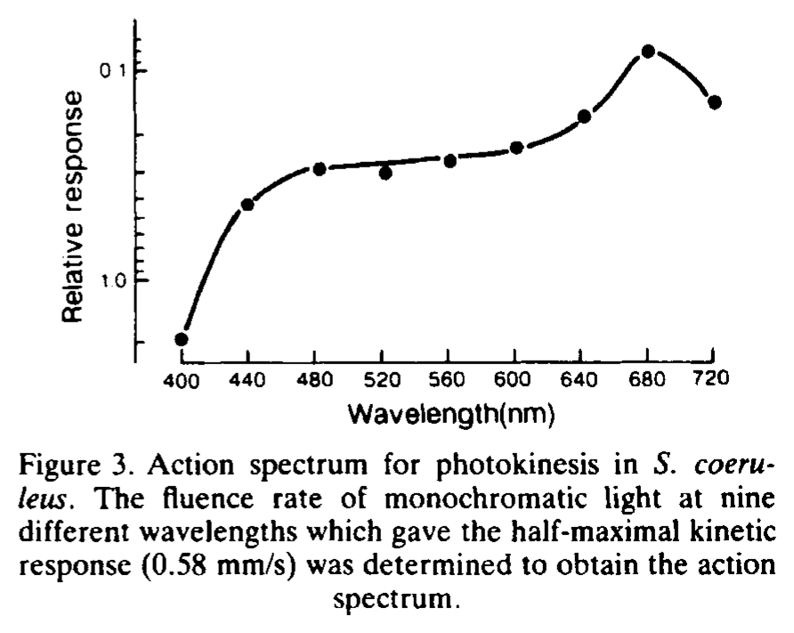

# Notes: Stentor coeruleus Photokinesis and the Action-Spectrum Literature

General background notes on photokinesis in *Stentor coeruleus*, built from Iwatsuki
(1992) plus everything else we've since pulled in the same literature. For the
actionable "which wavelength should we test" recommendation, see
[`WAVELENGTH_SELECTION_GUIDE.md`](WAVELENGTH_SELECTION_GUIDE.md) — this document is
the background/citation-heavy companion to that decision doc.

## Background: three photoresponse types

*S. coeruleus* has three distinct light responses:

- **Photophobic response** — a sudden increase in light causes a stop/ciliary-reversal
  ("avoiding reaction").
- **Phototaxis** — directed swimming away from a collimated light source (negative
  phototaxis).
- **Photokinesis** — steady-state swimming speed changes with ambient light level
  (faster in light, slower in dark; "positive photokinesis").

Iwatsuki (1992) reports *S. coeruleus* as the first protozoan shown to exhibit all
three. The photophobic response and phototaxis are well established to share a single
photoreceptor: **stentorin**, a hypericin-based chromophore concentrated in pigment
granules under the cell membrane, with absorption confined to roughly 525-630 nm. That
absorption band is also *why* the cell looks blue-green: perceived pigment color is the
complement of what's absorbed, so absorbing green-through-red leaves blue reflected
back.

Iwatsuki additionally claims photokinesis has its *own*, separate action spectrum
peaking at 680 nm — well outside stentorin's absorption band — which would imply a
second, distinct photoreceptor system. That claim is the main thing this document
interrogates, because our own StentorCam data shows little to no photokinetic response
at 680 nm.

## Iwatsuki (1992): what it reported

Source: Iwatsuki, K. (1992). *Stentor coeruleus* shows positive photokinesis.
*Photochemistry and Photobiology*, 55(3), 469-471.
(PDF kept in a local reference library, not committed here — see
`WAVELENGTH_SELECTION_GUIDE.md` Source Status for why)

- Mean swimming velocity ~0.6 mm/s at 100 lx, up to ~1.0 mm/s at 50000 lx (white light).
- Velocity increases roughly **linearly with log(fluence rate)** — a Weber-Fechner-type
  relationship, not linear in raw light intensity.
- The claimed photokinesis action spectrum (their Figure 3) peaks at **680 nm**, built
  by measuring a fluence-rate-vs-velocity dose-response curve at each of 9 wavelengths
  (400-720 nm) and reading off the fluence rate needed to reach a fixed criterion
  velocity (0.58 mm/s) at each one — collapsing 9 dose-response curves into 9
  comparable numbers, effectively an EC50-per-wavelength. (The mechanics of reading
  that figure — axis units, why 0.58 mm/s — are covered in the appendix at the bottom
  of this document, since they're specific to this one paper's figure rather than
  general findings.)
- Their light source was a filtered incandescent lamp (interference filters, <6 nm
  half-bandwidth, plus neutral-density filters) — see the light-source comparison table
  in `WAVELENGTH_SELECTION_GUIDE.md` for how this compares across the whole literature.

## Cross-paper wavelength synthesis

Pooling every reported action-spectrum/absorption peak across the *S. coeruleus*
literature we've gathered (not just Iwatsuki) makes the pattern clear:

{width=100%}

| Source | Response type | Reported peak(s) |
|---|---|---|
| Wood 1976 | Photophobic (electrophysiology) | 620 nm primary; 480 nm shoulder; 568 nm secondary (absorption data only) |
| Song 1980 | Phototaxis | ~610 nm (broad maximum) |
| Kim/Prusti/Song/Hader 1984 | Phototaxis + photophobic, Ca2+ role; quantum-efficiency action spectrum vs. absorption | ~610-615 nm primary; ~555-560 nm secondary; ~470 nm shoulder |
| Stentorin biochemistry (~1990, Song lab) | Pigment absorption / fluorescence-emission max | ~600-620 nm |
| Iwatsuki 1992 | Phototaxis/photophobic (cites the above) | 610 nm |
| **Iwatsuki 1992** | **Photokinesis** | **680 nm — the outlier** |

*Values for Wood 1976, Song 1980, and Kim/Prusti/Song/Hader 1984 confirmed directly
from the primary-source PDFs (kept in a local reference library, not committed here —
see `WAVELENGTH_SELECTION_GUIDE.md`'s Source Status section for why); only the
stentorin-biochemistry summary is still secondary, pending access.*

**Five independent measurements, spanning 1976-1992 and multiple labs/methods
(behavior, electrophysiology, pigment biochemistry), cluster tightly at 600-620 nm.**
Averaging the five primary peaks (620, 610, 612, ~605, 610) gives **~612 nm** as the
consensus wavelength — the single best bet for provoking *any* photoresponse in
*S. coeruleus*, stentorin-mediated or not. Wood's secondary features (568/480 nm) are
independently corroborated by Kim/Prusti/Song/Hader's own action spectrum
(~555-560/470 nm) — two labs, two different methods, converging on the same
multi-peak shape, which is much stronger evidence than a single paper. Still, treat
those secondary peaks as lower-confidence than the 610-620 nm primary cluster: Wood's
568 nm point specifically was never directly tested in his action spectrum (only
inferred from absorption spectra), unlike Kim/Prusti/Song/Hader's ~555-560 nm point,
which was directly measured.

680 nm is the outlier by every measure here: it's the only point off the cluster, it
comes from a single paper, and — as the next section covers — it has no matching
pigment and has never been independently replicated.

## Why the 680 nm photokinesis peak looks weak

### Citation history: cited as background, never independently re-tested

Iwatsuki (1992) has been cited at least 24 times (per Semantic Scholar), almost
entirely in reviews and later work on *Stentor*/*Blepharisma* photobiology — e.g.
Fabczak and coworkers' photosensory-transduction series (1993, 2006, 2008, 2010), the
*Photomovements in Ciliated Protozoa* book chapters (1998, 2001), and a 2022 paper on
behavioral-mode switching in *S. coeruleus*. In every citing paper we found, the 680 nm
photokinesis action spectrum is repeated as established background alongside the much
better-corroborated 610 nm phototaxis/photophobic-response peak — none appear to
independently re-measure or challenge it.

### No known pigment absorbs at 680 nm in this organism

Stentorin's absorption is confined to roughly 525-630 nm (Song 1980; Wood 1976; the
stentorin structure papers, Tao/Ghetti/Song ~1990) — essentially none at 680 nm.
Iwatsuki's own argument for "a second photoreceptor system" rests entirely on 680 nm
not fitting stentorin's absorption at all — but in the 30+ years since, no one appears
to have identified or proposed a candidate pigment that actually absorbs at 680 nm in
this non-photosynthetic ciliate (*S. coeruleus* has no plastids/chlorophyll). The claim
introduces an unidentified photoreceptor with no follow-up characterization work.

An independent, broader check points the same way: an AI-assisted literature synthesis
(Consensus.app, run July 2026, screening roughly 150 papers across the wider ciliate
photoreception literature — kept in a local reference library, not committed here for
copyright reasons) concluded that "the included literature does not provide strong
direct evidence for a second established visible-light photoreceptor alongside
stentorin" in *S. coeruleus* specifically. Its own comparative caveat — that other
ciliates/heterotrichs can use non-hypericin photoreceptors (rhodopsins, flavins) — is
explicitly flagged in that source as a cross-species point, not evidence for a second
pigment within *S. coeruleus* itself.

### Conclusion

The 610 nm peak (phototaxis/photophobic response) is corroborated by multiple
independent groups using absorption spectroscopy, electrophysiology, and behavior. The
680 nm photokinesis peak, by contrast, rests on this single 1992 paper: no independent
replication found, no identified photoreceptor pigment to explain it, and (see the
appendix) a methodologically thin criterion-velocity derivation. That gives a
reasonable literature-grounded basis for our data showing little response at 680 nm —
we may be observing a real discrepancy with an isolated, potentially non-reproducible
historical result, rather than an artifact of our own setup.

## Kühnel-Kratz & Häder (1994) follow-up: no wavelength retest, but two other caveats

Full text obtained (kept in a local reference library, not committed — see
`WAVELENGTH_SELECTION_GUIDE.md` Source Status). It does **not** retest the 680 nm question
— their light-reaction experiments used white light only, no monochromatic wavelength
sweep, so it neither confirms nor refutes Iwatsuki's action spectrum. Two other
findings from it are still relevant to our own setup, though:

- They observed positive photokinesis **only at fluence rates below ~10 W/m^2**; above
  that they saw no clear kinesis, in tension with Iwatsuki's claim of an almost-linear
  velocity-vs-log-fluence relationship across the *entire* tested range. Worth checking
  where our own fluence rates fall relative to this 10 W/m^2 cutoff.
- Their dark-swimming baseline velocities (1.5-1.8 mm/s) were notably higher than every
  previously published value (0.2-1.2 mm/s, including Iwatsuki's), which they attribute
  to their wider 25 mm cuvette reducing wall effects seen in smaller dishes/slides. If
  our chamber geometry is closer to the older, narrower setups, our baseline (dark)
  velocity may not be directly comparable to theirs either — worth controlling for
  chamber width/depth when comparing absolute velocities across studies.

## Kim/Prusti/Song/Hader (1984): obtained via interlibrary loan

Full text obtained via interlibrary loan (kept in a local reference library, not
committed — see `WAVELENGTH_SELECTION_GUIDE.md` Source Status). Its Fig. 1 plots a
proper quantum-efficiency action
spectrum for the step-up photophobic response directly against stentorin's measured
absorption spectrum (both in vivo and at 77 K) — a more direct optical comparison than
Iwatsuki's inverted-fluence-rate "relative response" proxy (see appendix). The action
spectrum shows the same multi-peak shape as Wood 1976: primary peak ~610-615 nm,
secondary ~555-560 nm, smaller shoulder ~470 nm, then a sharp drop-off past ~630-650
nm. Light source: a 300 W slide projector (Gold) with ~10 nm half-bandwidth
interference filters and a Kettering radiant power meter — the same lamp-and-filter
pattern as every other paper in this literature (see the light-sources comparison in
`WAVELENGTH_SELECTION_GUIDE.md`).

## Appendix: how Iwatsuki's Figure 3 was actually built

Detail specific to this one paper's figure, kept here rather than in the main body
above since it's methodological mechanics rather than a general finding.

{width=100%}

- **Y-axis is logarithmic *and* inverted.** The label reads "Relative response," but
  the plotted units are actually **fluence rate (W/m^2)** needed to hit the 0.58 mm/s
  criterion velocity — same scale as Fig. 2a's x-axis (log, ~0.1-1.0+ W/m^2). Neither
  Fig. 3's axis nor its caption print a unit; W/m^2 is inferred by matching it against
  Fig. 2's explicitly labeled intensity axis ("0.1 W/m^2 (400 nm)", etc.), which
  measures the same quantity over the same numeric range. The axis is drawn inverted
  (small numbers near the top) so that "higher on the page" reads as "more sensitive"
  (less light needed) — a standard action-spectrum convention, but it means the raw
  printed numbers are fluence rates, not sensitivity units.
- **Specific values:** 680 nm needed ~0.08 W/m^2 to reach 0.58 mm/s (most sensitive
  point tested); 400 nm needed ~1.1 W/m^2 (least sensitive) — a genuine ~14x ratio, not
  a mild bias. Curve shape: steep rise 400-440 nm, plateau ~440-600 nm, second climb to
  the peak at 680 nm, then a drop at 720 nm.
- **Why 0.58 mm/s as the criterion velocity:** the paper doesn't explain this number
  directly. It's *not* a measured dark-floor/light-ceiling midpoint — a true zero-light
  data point isn't measurable with their setup (the same light source doubles as the
  dark-field illumination the tracking camera needs to see the cell at all), and no
  plateau/saturation is described in either of their fluence-response figures across
  the *entire* tested range. The more likely explanation: 0.58 mm/s is a fixed
  criterion that happens to fall within the overlapping, actually-measured range of all
  nine wavelength-specific curves, letting a fluence-rate value be interpolated (not
  extrapolated) for each of the 9 wavelengths — the standard practical reason for
  picking one criterion response when collapsing several dose-response curves into a
  single action spectrum.
